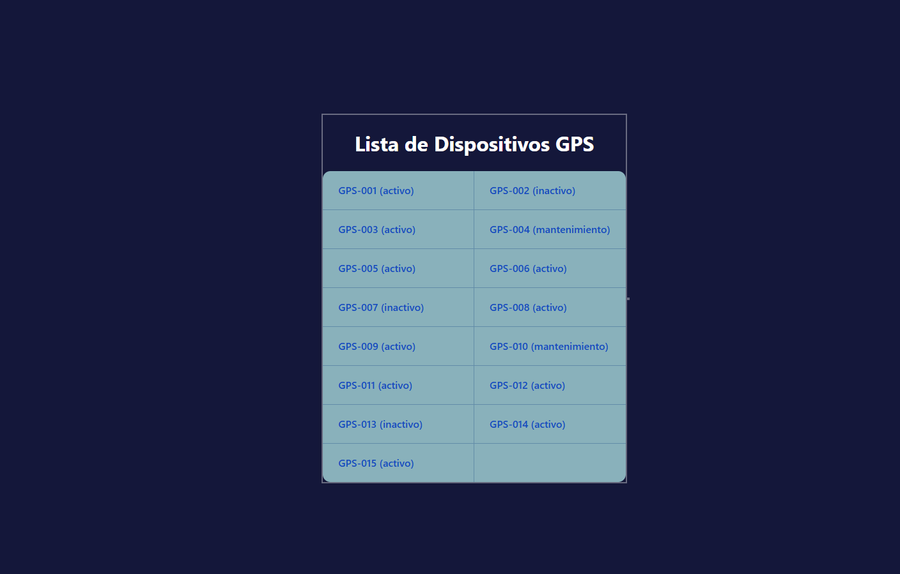

# Prueba Técnica AZSmartT

Prueba Técnica - Desarrollador Junior React JS | Python

## Descripción

Este proyecto es una aplicación fullstack desarrollada por Brayan Steven Ramirez Diaz, que permite visualizar y gestionar dispositivos GPS. El backend está construido con **Python (FastAPI)** y el frontend con **React**. Todo el entorno se ejecuta fácilmente utilizando **Docker** y **Docker Compose**.

---

## Requisitos Previos

- [Docker](https://www.docker.com/) instalado en la máquina.
- [Docker Compose](https://docs.docker.com/compose/) (si la versión de Docker no lo incluye).

---

## ¿Cómo ejecutar la aplicación?

1. **Clonar el repositorio:**

   ```bash
   git clone https://github.com/BrayanStevenRamirezDiaz/PruebaTecnicaAZSmartT
   cd tu-repo
   ```

2. **Ejecutar los servicios con Docker Compose:**

   ```bash
   docker-compose up --build
   ```

   Esto levantará dos servicios:
   - **backend**: FastAPI en el puerto `8000`
   - **frontend**: React en el puerto `3000` (internamente usa el 5173)

3. **Acceder a la aplicación:**

   - Abrir el navegador y entrar a: [http://localhost:3000](http://localhost:3000)

---

## Estructura del Proyecto

```
├── Backend
│   ├── main.py
│   ├── data.py
│   ├── requirements.txt
│   └── ...
├── Frontend
│   └── gps-app-vite
│       ├── src/
│       ├── package.json
│       └── ...
├── docker-compose.yml
└── README.md
```

---

## Imagenes de Referencia

-  
   

## Comandos útiles

- **Detener los servicios:**
  ```bash
  docker-compose down
  ```

- **Reconstruir los contenedores (si se cambian dependencias):**
  ```bash
  docker-compose up --build
  ```

---

## Notas

- El backend expone la API en [http://localhost:8000/docs](http://localhost:8000/docs) (documentación Swagger).
- El frontend se comunica automáticamente con el backend usando la variable de entorno definida en `.env`.
- Si se presentan problemas con los puertos, asegurarse de que los puertos 8000 y 3000 estén libres en la máquina.

---

## Autor

- [Brayan Steven Ramirez Diaz](https://github.com/BrayanStevenRamirezDiaz/PruebaTecnicaAZSmartT)

---
